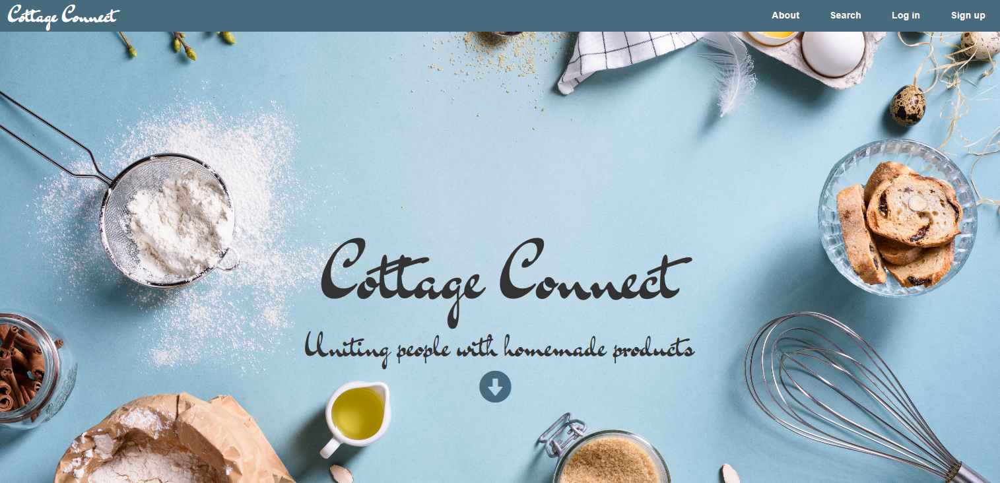
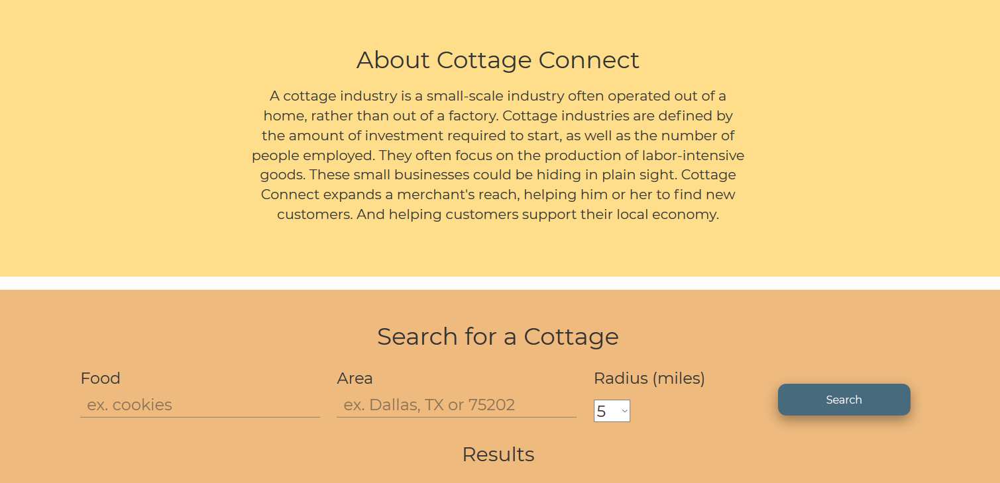
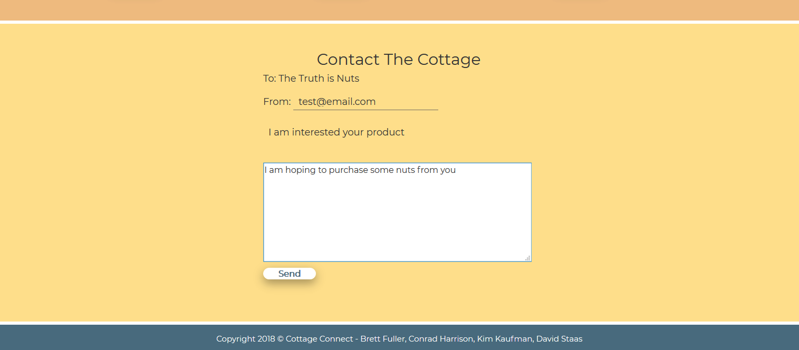
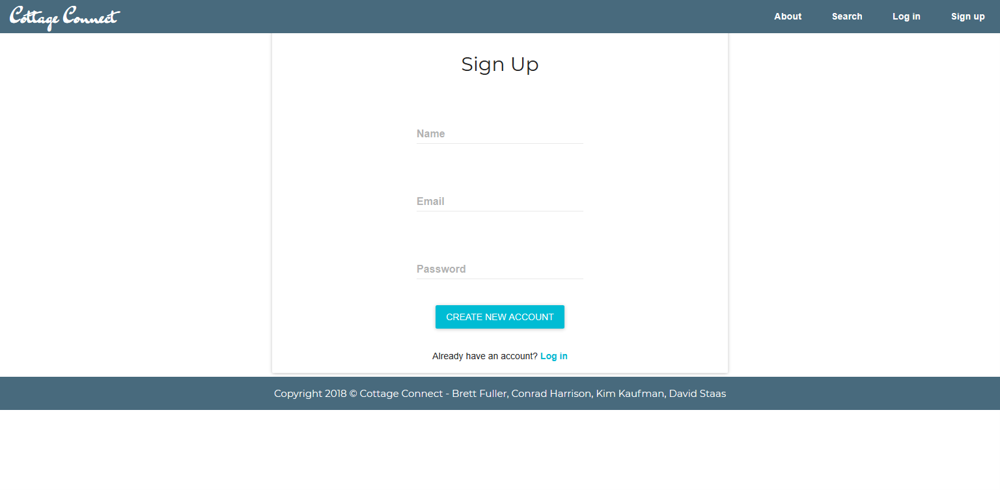
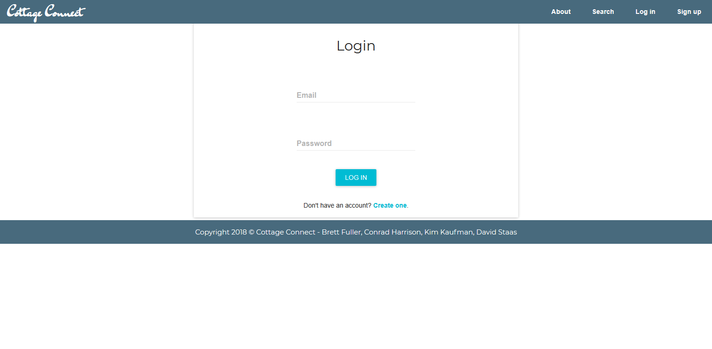
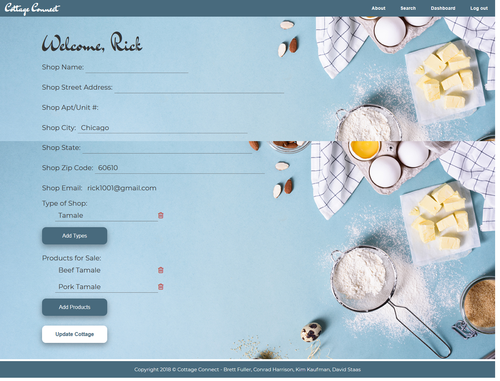

# cottageconnecttestdeploy

# Cottage Connect

### Mission
### Built With
### Walk Through
### Authors

## Mission

Cottage Connect works diligently to allow people to test out their small, cottage industry without having to worry about how they are going to attract business. We connect your customers to you by providing you an area where you can setup your store, and provide users with a simple interface to locate you.

Cottage industry laws are out to make it easier for you to test your hand at a small business, but there is still a lot to handle to create your online presence. Most companies use Facebook to setup their site, but unfortunately people don't search Facebook to locate a new vendor to purchase goods from. You are uncomfortable listing your house on Yelp, and your items don't quite fit into the mission of Etsy. Meet Cottage Connect, allowing your neighbors to quickly find out who in their area is selling homemade scones, freshly roasted coffee beans, or their grandmother's award winning muffins.

So you focus on making the best items you can, and let us handle bringing your customers to you.

## Built With

  #### Front-End
  * HTML/CSS
    * including Flexbox
  * React
  * axios

  #### Back-End
  * NodeJS
  * MongoDB/Mongoose
  * Nodemailer
  * Passport
  * React-Router
  * axios
  * bcryptjs
  * jsonwebtoken
  * validator

## Walkthrough

Cottage Connect has two sides or its users, merchants (also known as cottages), and shoppers. All users will initially hit our landing page, which is designed to be as minimal as possible to make it easy on our users. It is inspired by single page apps, while still having a portal that our merchants can use. Everything a shopper can want is available on this landing page.

  #### Shopper
  A shopper can search our system by putting in a food that they are interested in, or the area they are looking for items.
  
  

  Once the shopper has found the cottage they would like to learn more about they click the contact button to use our system to send a direct email to shop.
  

  #### Cottage

  The first thing a cottage will do is to sign up, at which our system will create both their user information as well begin setting up their cottage.
  

  After signing up, they will be asked to login on our login page.
  

  Once logged in, the cottage can edit everything about their cottage from its name, to its inventory. These results are instantly updated into our database so shoppers can instantly be drawn into their goods!
  

## Authors (alphabetical order)

  #### [Brett Fuller](https://github.com/bfuller123)
  #### [Conrad Harrison](https://github.com/RadCon4)
  #### [Kim Kaufman](https://github.com/kimgomizzou)
  #### [David Staas](https://github.com/DavidStaas)
